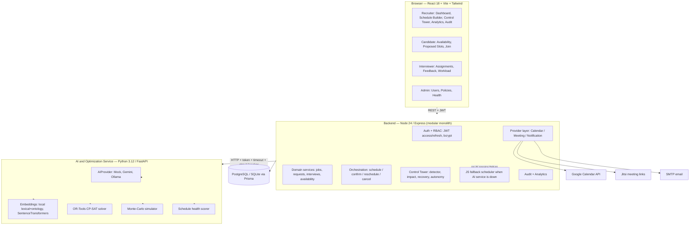
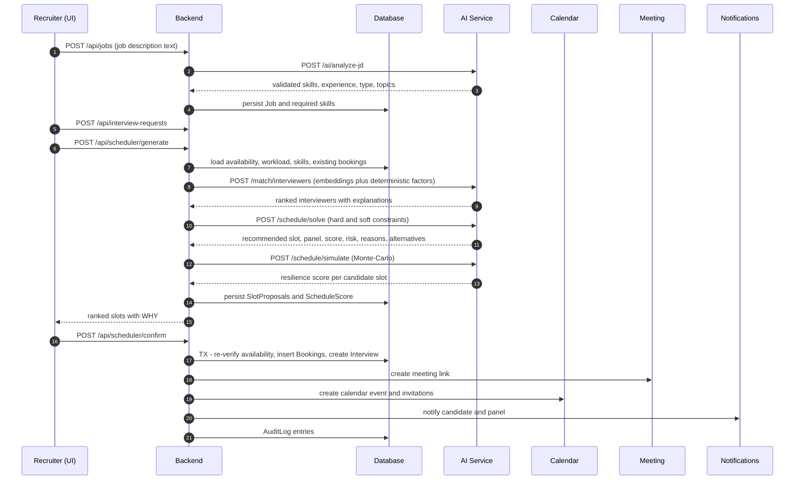
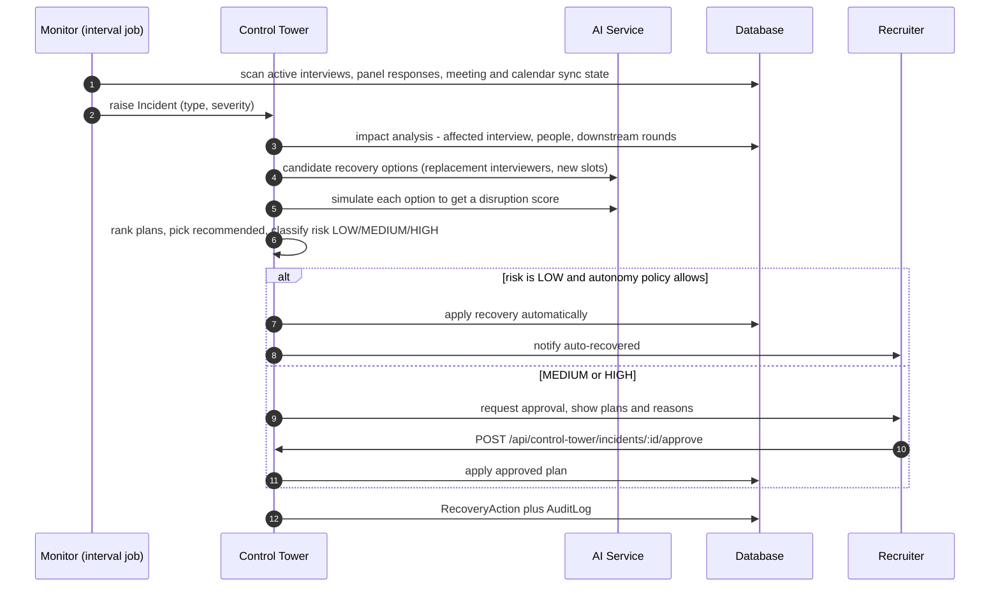
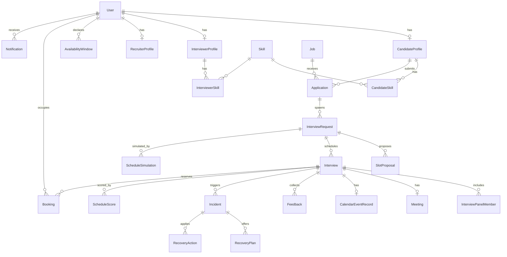

# Architecture — Smart Interview Scheduler / AI Interview Orchestration Platform

## 1. One-paragraph solution overview

Most interview tools answer *"is this slot free?"*. This platform answers *"is this interview plan
good, resilient, and likely to survive contact with reality — and what do we do the moment it
isn't?"*. It is a **modular monolith** (React + Express + Prisma) paired with **one specialised
Python service** that owns everything mathematical: constraint optimisation (OR-Tools CP-SAT),
Monte-Carlo disruption simulation, embedding-based skill matching, and all LLM calls. A background
**Control Tower monitor** watches live interviews, raises incidents, computes cascading impact,
generates and ranks recovery plans, and applies them under an explicit **autonomy policy**.

## 2. Guiding principle for intelligence

```
AI (LLM)      -> ambiguity and language   (JD parsing, resume parsing, NL availability, feedback analysis, message drafting)
Algorithms    -> guarantees               (hard constraints, conflicts, time zones, buffers, RBAC, double-booking)
Optimization  -> scheduling               (OR-Tools CP-SAT weighted objective over feasible slot/panel assignments)
Simulation    -> uncertainty              (Monte-Carlo disruption scenarios -> resilience score)
```

An LLM never decides a schedule. Every LLM output is parsed into a Pydantic schema, validated,
retried once on malformed output, and falls back to a deterministic extractor. The optimizer only
ever consumes **validated structured constraints**.

## 3. System architecture



**Why a modular monolith plus one AI service (and not 15 microservices):** the scheduling domain is
a single tightly-coupled transactional boundary — splitting interviews, panels and bookings across
services would turn one database transaction into a distributed saga for no benefit at this scale.
The one split we *do* make follows a genuine technology seam: CP-SAT, NumPy and LLM SDKs are
Python-native, and that workload is CPU-bound and independently scalable.

## 4. Core scheduling flow (sequence)



## 5. Control Tower incident lifecycle



## 6. Data model overview



**Portability decision:** the Prisma schema deliberately uses no `enum`, no scalar lists and no
`Json` columns. Enumerations are `String` columns validated against shared constant sets, and
structured payloads are JSON-encoded `String`s with typed serialisers. One schema file therefore
works byte-identically on **SQLite** (zero-install demo, fast tests) and **PostgreSQL**
(production), switchable with `npm run db:use-postgres`. Trade-off: we give up DB-level enum
enforcement and JSONB query operators, and we buy a system a judge can run in 90 seconds with no
Docker daemon.

## 7. Concurrency and double-booking

The `Booking` table is the single source of truth for "this person's time is taken".
Confirmation runs inside a Prisma `$transaction`:

1. re-read every participant booking overlapping `[start - buffer, end + buffer)`;
2. abort with `409 SLOT_TAKEN` if any exist;
3. insert `Booking` rows guarded by `@@unique([userId, startUtc])`, which catches the exact
   duplicate race even if two transactions interleave;
4. `Interview.version` gives optimistic locking on updates, and an `IdempotencyKey` table makes a
   retried POST return the original response instead of creating a second interview.

Overlap uniqueness is not portably expressible in SQL (no `EXCLUDE USING gist` on SQLite), so the
transaction plus unique constraint plus pre-commit re-verification is the defence, and the race is
covered by a test that fires concurrent confirmations at the same slot.

## 8. Modules and ownership

| Module | Location | Responsibility |
|---|---|---|
| Auth/RBAC | `backend/src/middleware/auth.js` | JWT verify, role guard, resource ownership guard |
| Domain services | `backend/src/services/*.service.js` | Jobs, candidates, interviewers, availability, requests |
| Orchestration | `backend/src/services/orchestration.service.js` | Generate, confirm, reschedule, cancel |
| Control Tower | `backend/src/services/controlTower.service.js`, `monitor.js` | Detect, analyse, recover, autonomy |
| Providers | `backend/src/providers/*` | Calendar / Meeting / Notification / AI-client abstractions |
| Optimizer | `ai-service/app/services/optimizer.py` | CP-SAT model, objective weights, explanations |
| Simulator | `ai-service/app/services/simulator.py` | Monte-Carlo disruption scenarios, resilience |
| Health scorer | `ai-service/app/services/health.py` | Explainable schedule health breakdown |
| AI providers | `ai-service/app/providers/*` | Mock / Gemini / Ollama plus embeddings |

## 9. Implementation roadmap

| Stage | Content |
|---|---|
| 0 | Architecture, schema, API boundaries |
| 1 | Monorepo foundation, health endpoints, connectivity |
| 2 | Auth and RBAC |
| 3 | Profiles, skills, availability |
| 4 | Jobs, applications, interview requests |
| 5 | Scheduling engine (OR-Tools plus JS fallback) |
| 6 | AI integration (JD, resume, NL availability, feedback, messages) |
| 7-10 | Calendar, meetings, notifications, candidate and interviewer flows |
| 11-14 | Adaptive pipeline, Control Tower, digital twin, analytics and audit |
| 15-18 | Edge cases, security, tests, polish, hackathon package |
